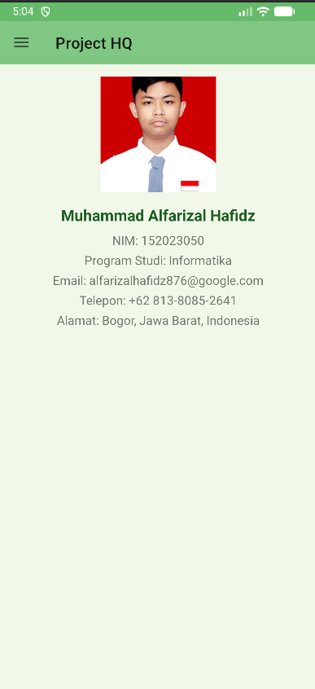

# Project-HQ
Project HQ adalah aplikasi mobile berbasis Android Studio yang dirancang untuk menampilkan integrasi berbagai fitur dasar dalam satu platform sederhana namun interaktif.
Aplikasi ini dikembangkan menggunakan Kotlin dengan Gradle Kotlin DSL, serta menerapkan Material Design 3 bertema hijau lembut yang memberikan kesan alami, segar, dan nyaman digunakan.

🎯 Tujuan Proyek

Proyek ini bertujuan untuk:

Melatih kemampuan pengembangan aplikasi Android modern dengan struktur multi-fragment dan Navigation Drawer.

Menerapkan berbagai komponen UI seperti RecyclerView, Spinner, RadioButton, DatePicker, dan ViewBinding.

Menyimulasikan aplikasi dashboard dengan data statis, namun memiliki tampilan dan interaksi menyerupai aplikasi nyata.

⚙️ Fitur Utama

•	Splash Screen
Tampilan pembuka selama 5 detik yang menampilkan logo dan judul aplikasi.

  

•	Dashboard (Navigation Drawer)
Menu navigasi utama yang menghubungkan ke berbagai halaman menggunakan Fragment.

  

•	Biodata
Formulir berisi data diri dengan foto profil, input teks, radio button, dropdown, dan tanggal lahir.

  

•	Kontak
Daftar 15 kontak dengan nama, nomor telepon, dan avatar bulat yang dimuat dari sumber online.

  

•	Kalkulator
Fitur kalkulator sederhana dengan operasi matematika dasar seperti tambah, kurang, kali, bagi, kuadrat, dan akar kuadrat.

  

•	Cuaca
Menampilkan informasi cuaca statis (suhu, kelembapan, kondisi) dengan ikon cuaca dari sumber online.

  

•	Berita
Menampilkan daftar berita statis berupa gambar dan ringkasan teks menggunakan RecyclerView.

  

🧩 Teknologi yang Digunakan

Android Studio (Kotlin)

Gradle Kotlin DSL

Material Design Components (Material3)

Coil untuk pemuatan gambar dari internet

ViewBinding untuk akses elemen UI yang aman

RecyclerView untuk daftar dinamis

🌿 Tema dan Desain

Tampilan menggunakan tema hijau lembut (Soft Green Theme) dengan warna utama #81C784, memberikan nuansa alami dan ramah pengguna, selaras dengan konsep HydroBase sebagai “dasar yang tenang dan bersih”.
